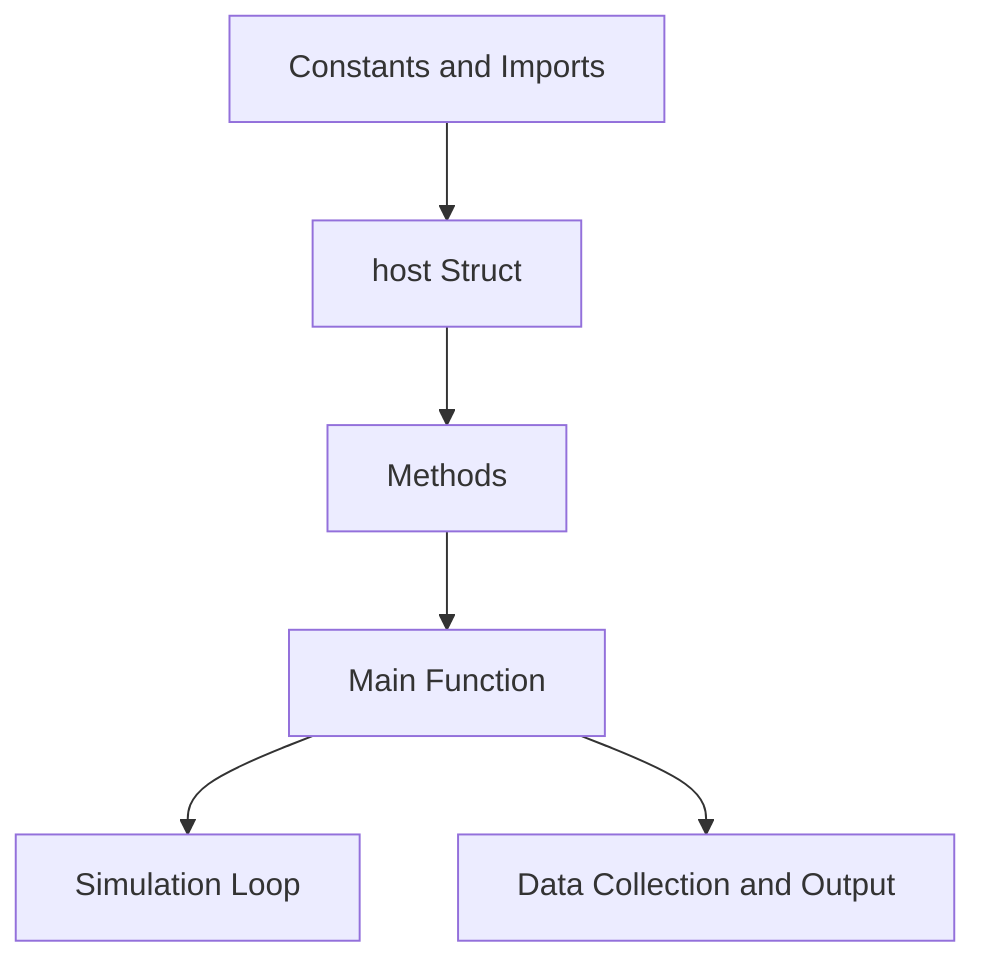

# Outbreak Model
 A model designed to simulate walking hosts, with the option to set some as infected, some as not. Various logical segments to be designed soon


Certainly! I'll provide a detailed explanation of the code using text and a simplified textual representation (Mermaid-like diagram) in Markdown format.


## Rust Disease Spread Simulation

This Rust code simulates the spread of a disease within a population of hosts (chickens).

### Components and Flow




### Constants and Imports

- The code imports necessary libraries such as `rand`, `statrs`, `serde`, `serde_json`, and `csv`.
- It defines various constants related to space, disease, collection, and resolution.

### host Struct

The `host` struct represents an individual chicken in the simulation. It has attributes like infection status, movement, location, and age.

```rust
pub struct host {
    infected: bool,
    motile: u8,
    zone: usize,
    prob1: f64,
    prob2: f64,
    x: f64,
    y: f64,
    age: f64,
}
```

### Methods for host Struct

- `transport`: Moves the host to a new zone.
- `transfer`: Simulates disease transmission between hosts.
- `new` and `new_inf`: Create new hosts with various attributes.
- `deposit` and `deposit_all`: Simulate hosts laying deposits.
- `shuffle` and `shuffle_all`: Simulate host movement.
- `dist`: Check if hosts are within disease transmission distance.
- `transmit`: Simulate disease transmission.
- `cleanup`: Remove non-consumable deposits.
- `collect`: Collect hosts and deposits based on age.
- `report`: Calculate infection rates.

### Main Function

The `main` function is the entry point of the simulation.

- Generates a population of chickens on a grid.
- Simulates movement, disease spread, and collection over a specified time.
- Logs infection rates and collection rates.
- Outputs results to `output.csv` and parameter details to `parameters.txt`.

### Running the Simulation

1. Uncomment the `main()` function to run the simulation.
2. Adjust constants to customize simulation parameters.
3. Run the Rust code.

### Interpretation

Analyze the `output.csv` file to understand disease progression, infection rates, and collection rates.


## Integrating Rust Simulation with R Data Visualization

The integration of the Rust simulation code with R data visualization enables a comprehensive analysis of infection dynamics and their visualization. The process involves generating infection data using Rust and then using R to visualize and analyze this data.

### Rust Simulation and Data Generation

1. **Compile and Execute Rust Code**:
   - Navigate to the directory containing the Rust code.
   - Compile and run the Rust code using the command: `cargo run`
   - This will execute the Rust simulation, generating the "output.csv" file containing infection data.

### R Data Visualization and Analysis

1. **Execute R Visualization Script**:
   - Ensure that R and pandoc are added to your system's PATH environment variable to enable seamless execution of R scripts and HTML conversion.
   - Navigate to the directory containing the R code ("plotter.R").
   - Run the R script using the command: `cargo run | Rscript.exe plotter.R`
   - The '|' symbol is important and facilitates a smooth transition from Rust data generation to R visualization.

2. **Generated Visualizations**:
   - The R script processes the infection data from "output.csv" and generates various types of visualizations, including heatmaps, 2D histograms, hexbin plots, surface plots, and scatter plots.
   - Interactive plots are saved as HTML files that can be opened in web browsers for exploration.
   - Static plots are also generated as PNG images.

3. **Opening Interactive Plots**:
   - After running the R script, you can open the generated interactive HTML plots by double-clicking the HTML files ("heatmap_output.html," "Heatmap_2dHistogram.html," etc.).

By integrating Rust simulation with R data visualization, you can seamlessly transition from data generation to in-depth analysis and visualization, resulting in a comprehensive understanding of infection dynamics.
