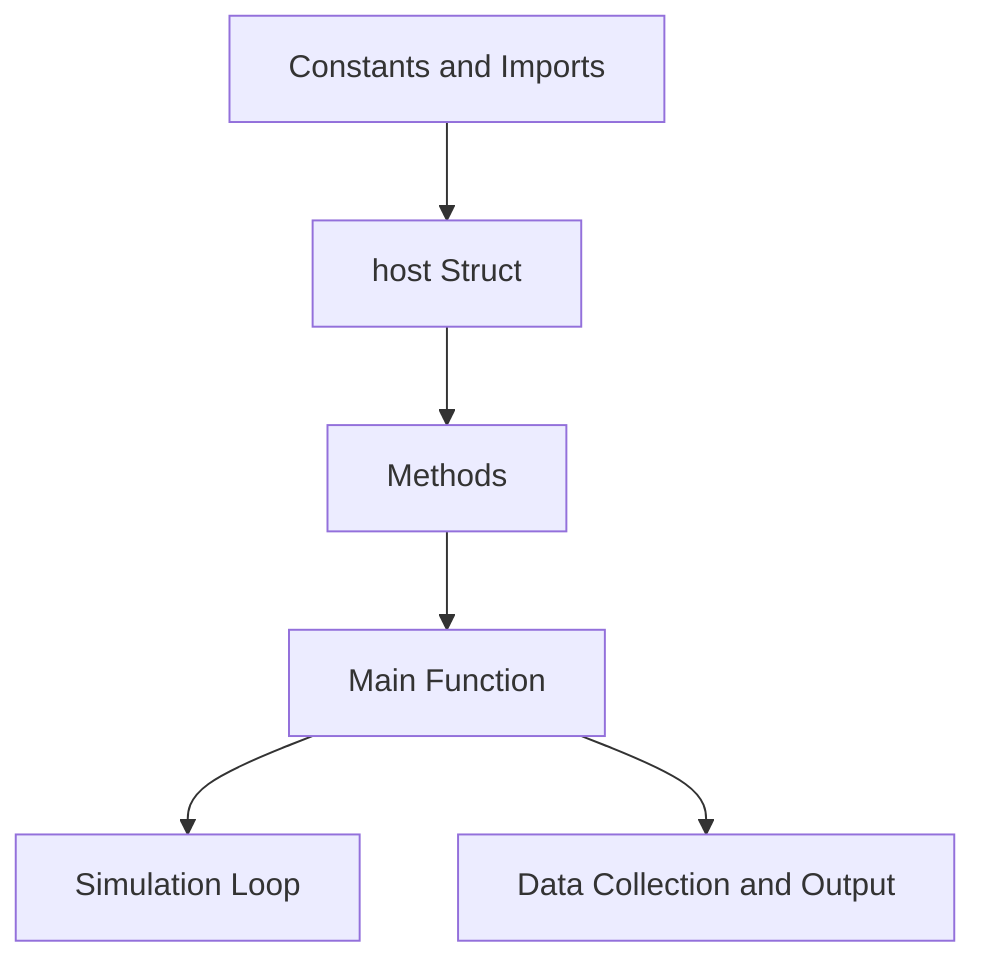

# Outbreak Model
 A model designed to simulate walking hosts, with the option to set some as infected, some as not.

## Outbreak Model: Simulating Infectious Disease Transmission in Enclosed Facilities

The **Outbreak Model** is a versatile simulation framework designed for a range of applications, including the simulation of infectious disease transmission within enclosed facilities. This model offers the capability to simulate the movement of hosts, allowing for the designation of some as infected and others as uninfected. This flexibility provides valuable insights into how diseases can spread in closed environments, making it particularly relevant for studying and understanding outbreak scenarios.

### Key Features and Functionality

The **Outbreak Model** is built to replicate real-world scenarios where individuals (represented as "hosts") move within an enclosed space. By configuring hosts as infected or non-infected, the model can mimic initial outbreak conditions. This feature is especially valuable for studying disease dynamics and evaluating potential intervention strategies.

#### Simulating Infection Dynamics

The model's capacity to simulate infections among hosts allows for the investigation of disease spread over time. Researchers and public health experts can adjust infection parameters and initial conditions to observe the progression of an outbreak. This includes monitoring infection rates, identifying high-risk areas, and evaluating the effectiveness of preventive measures.

#### Exploring Intervention Strategies

The **Outbreak Model** excels in assessing intervention strategies. Users can simulate the impacts of isolation, quarantine, vaccination, and other measures to gauge their efficacy in containing disease spread. These simulations provide valuable insights to decision-makers regarding the potential outcomes of different interventions and aid in resource allocation planning.

### Applications in Infectious Disease Control

The **Outbreak Model** is particularly promising for infectious disease control, especially within enclosed facilities like hospitals, schools, and communal settings. Its applications encompass:

- **Predictive Modeling:** Using real-world data and parameters, the model generates predictions about outbreak trajectories, aiding in resource preparation.

- **Scenario Analysis:** The model facilitates "what-if" scenarios, helping decision-makers understand policy consequences and intervention impacts.

- **Training and Education:** The model serves as an educational tool to teach students, researchers, and healthcare professionals about disease transmission dynamics and intervention effects.

- **Resource Allocation:** Simulations assist in optimizing resource allocation, such as healthcare personnel and medical supplies, during outbreaks.

### Applications in Infectious Disease Control

The **Outbreak Model** is a valuable computational tool with diverse applications, including simulating infectious disease transmission in enclosed facilities. By accurately capturing host movement and interactions, as well as infection dynamics, the model contributes to our understanding of disease spread and aids in developing effective containment strategies. Its versatility makes it a powerful asset for researchers, policymakers, and healthcare practitioners seeking to enhance preparedness and response strategies in the face of outbreaks.

As demonstrated by its interaction with Rust-generated data and subsequent visualization using R and Pandoc, the **Outbreak Model** exemplifies how the tool can extract meaningful insights from simulated scenarios, further contributing to informed decision-making in disease control efforts.

## Rust Disease Spread Simulation

This Rust code simulates the spread of a disease within a population of hosts (chickens).

### Components and Flow




### Constants and Imports

- The code imports necessary libraries such as `rand`, `statrs`, `serde`, `serde_json`, and `csv`.
- It defines various constants related to space, disease, collection, and resolution.

### host Struct

The `host` struct represents an individual chicken in the simulation. It has attributes like infection status, movement, location, and age.

```rust
pub struct host {
    infected: bool,
    motile: u8,
    zone: usize,
    prob1: f64,
    prob2: f64,
    x: f64,
    y: f64,
    age: f64,
}
```

### Methods for host Struct

- `transport`: Moves the host to a new zone.
- `transfer`: Simulates disease transmission between hosts.
- `new` and `new_inf`: Create new hosts with various attributes.
- `deposit` and `deposit_all`: Simulate hosts laying deposits.
- `shuffle` and `shuffle_all`: Simulate host movement.
- `dist`: Check if hosts are within disease transmission distance.
- `transmit`: Simulate disease transmission.
- `cleanup`: Remove non-consumable deposits.
- `collect`: Collect hosts and deposits based on age.
- `report`: Calculate infection rates.

### Main Function

The `main` function is the entry point of the simulation.

- Generates a population of chickens on a grid.
- Simulates movement, disease spread, and collection over a specified time.
- Logs infection rates and collection rates.
- Outputs results to `output.csv` and parameter details to `parameters.txt`.

### Running the Simulation

1. Uncomment the `main()` function to run the simulation.
2. Adjust constants to customize simulation parameters.
3. Run the Rust code.

### Constants Explanation

In the provided Rust code, the simulation is set up using various constants (prefixed with "const" and written in uppercase) that define various parameters of the simulation. These constants determine the behavior and characteristics of the simulated environment, hosts, disease transmission, collection, and other aspects of the simulation. Here's an explanation of what each constant represents and some examples of values to choose for them:

1. `LISTOFPROBABILITIES`:
   - This constant represents the probability of transfer of salmonella per zone. It is an array that holds the probabilities for each zone in the simulation.
   - Example: `[0.1, 0.75, 0.05, 0.03, 0.15]` represents a set of probabilities for five different zones, where zone 1 has a 10% probability of transfer, zone 2 has a 75% probability, and so on.

2. `GRIDSIZE`:
   - Represents the dimensions of the grid that hosts are placed on.
   - Example: `[3000.0, 3000.0]` defines a 3000x3000 unit grid.

3. `MAX_MOVE`, `MEAN_MOVE`, `STD_MOVE`:
   - Constants related to the movement of hosts. They define the maximum possible move distance, the mean move distance, and the standard deviation of the move distance, respectively.
   - Example: `MAX_MOVE = 25.0`, `MEAN_MOVE = 5.0`, `STD_MOVE = 10.0` could represent that hosts can move up to 25 units, with an average move of 5 units and a deviation of 10 units.

4. `TRANSFER_DISTANCE`:
   - Represents the maximum distance over which hosts can transmit diseases to one another.
   - Example: `TRANSFER_DISTANCE = 1.0` indicates that disease transmission can occur within a distance of 1 unit.

5. `AGE_OF_HOSTCOLLECTION`, `AGE_OF_DEPOSITCOLLECTION`:
   - Constants that define the age at which hosts and deposits are eligible for collection.
   - Example: `AGE_OF_HOSTCOLLECTION = 30.0 * 24.0` represents a collection age of 30 days for hosts, and `AGE_OF_DEPOSITCOLLECTION = 1.0 * 24.0` represents a collection age of 1 day for deposits.

6. `FAECAL_CLEANUP_FREQUENCY`:
   - Represents how many times a day faecal matter cleanup is performed.
   - Example: `FAECAL_CLEANUP_FREQUENCY = 4` means that faecal matter cleanup is performed four times a day.

7. `STEP`:
   - Represents the number of chickens per unit distance when generating chickens.
   - Example: `STEP = 20` indicates that chickens are generated in a grid with 20 chickens per unit distance.

8. `HOUR_STEP`:
   - Represents the number of times chickens move per hour.
   - Example: `HOUR_STEP = 4.0` means that chickens move four times within an hour.

9. `LENGTH`:
   - Represents the duration of the simulation in hours.
   - Example: `LENGTH = 45 * 24` corresponds to a simulation duration of 45 days.

These constants play a crucial role in defining the simulation's behavior and characteristics. Depending on the nature of the simulation and the specific scenario you're modeling, you would choose appropriate values for these constants to achieve the desired outcomes and behaviors within the simulated environment.


### Interpretation

Analyze the `output.csv` file to understand disease progression, infection rates, and collection rates.


## Integrating Rust Simulation with R Data Visualization

The integration of the Rust simulation code with R data visualization enables a comprehensive analysis of infection dynamics and their visualization. The process involves generating infection data using Rust and then using R to visualize and analyze this data.

### Rust Simulation and Data Generation

1. **Compile and Execute Rust Code**:
   - Navigate to the directory containing the Rust code.
   - Compile and run the Rust code using the command: `cargo run`
   - This will execute the Rust simulation, generating the "output.csv" file containing infection data.

### R Data Visualization and Analysis

1. **Execute R Visualization Script**:
   - Ensure that R and pandoc are added to your system's PATH environment variable to enable seamless execution of R scripts and HTML conversion.
   - Navigate to the directory containing the R code ("plotter.R").
   - Run the R script using the command: `cargo run | Rscript.exe plotter.R`
   - The '|' symbol is important and facilitates a smooth transition from Rust data generation to R visualization.

2. **Generated Visualizations**:
   - The R script processes the infection data from "output.csv" and generates various types of visualizations, including heatmaps, 2D histograms, hexbin plots, surface plots, and scatter plots.
   - Interactive plots are saved as HTML files that can be opened in web browsers for exploration.
   - Static plots are also generated as PNG images.

3. **Opening Interactive Plots**:
   - After running the R script, you can open the generated interactive HTML plots by double-clicking the HTML files ("heatmap_output.html," "Heatmap_2dHistogram.html," etc.).
   - 
   ## Exploring Generated Visualizations

The R script generates a variety of visualizations based on the infection data obtained from the Rust simulation. Each visualization provides unique insights into infection dynamics and patterns. Below are descriptions and explanations for each of the generated plots:

### Heatmap of Coordinates

The "heatmap_output.html" file presents a heatmap that visualizes the density of infection occurrences across different coordinates. The color intensity represents the density of infections at specific points, allowing you to identify regions with higher infection rates.

### 2D Histogram of Occurrences

The "Heatmap_2dHistogram.html" file displays a 2D histogram that captures the joint distribution of infections along the X and Y axes. The color scale indicates the frequency of infections in specific regions of the plot. This visualization helps in understanding the spatial relationship between infections.

### Hexbin Plot Example

The "hexbin_plot.html" file showcases a hexbin plot, which is a variation of a scatter plot that aggregates points into hexagonal bins. This plot provides a clear representation of infection density, with darker areas indicating higher infection occurrences.

### Surface Plot Example

The "surface_plot.html" file features a 3D surface plot that illustrates the change in infection occurrence over time and spatial coordinates. The color gradient indicates the variation in infection intensity. This plot is particularly useful for observing temporal trends in infection dynamics.

### Infection Trend within Cultivation

The "scatter_plot_1.html" file presents a scatter plot that showcases the infection trend within the cultivation process. It provides insights into the infection percentages of both motile hosts and sessile deposits over time. Each line represents a different category, allowing for easy comparison.

### Infection Trend within Collection

The "scatter_plot_2.html" file depicts the infection trend within the collection process. Similar to the previous scatter plot, it displays infection percentages of motile hosts and sessile deposits. This plot aids in understanding infection dynamics during the collection phase.

### Infection Trend across Population

The "scatter_plot_final.html" file offers an overview of infection trends across the entire population. It combines data from both cultivation and collection phases, providing insights into the overall infection percentages of motile hosts and sessile deposits.

These visualizations collectively offer a comprehensive view of infection dynamics, enabling you to identify patterns, trends, and correlations within the simulated data.

---
By integrating Rust simulation with R data visualization, you can seamlessly transition from data generation to in-depth analysis and visualization, resulting in a comprehensive understanding of infection dynamics.
